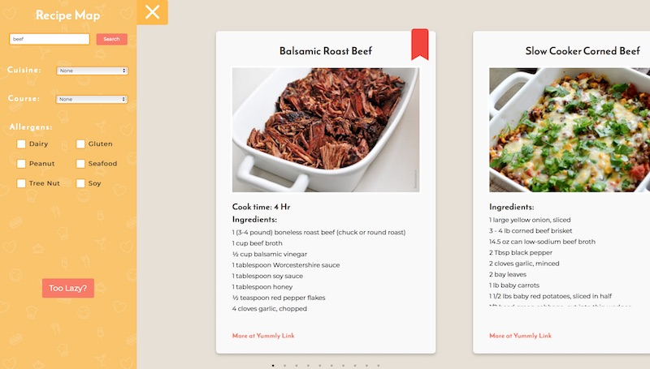
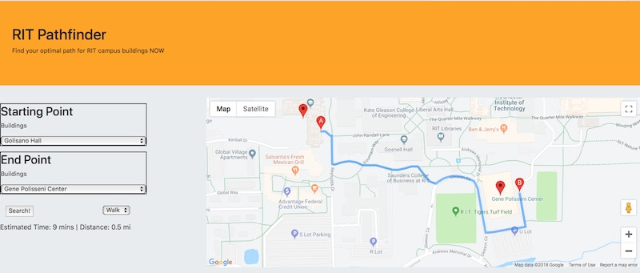
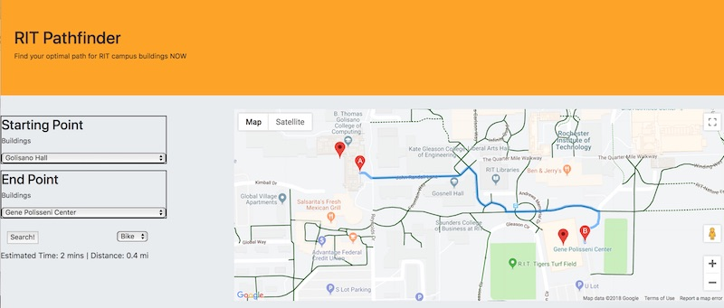

# Project 2 - MVVM Web App Mashup of Awesomeness!

## I. Overview

\*\* **TLDR** \*\* - *if you don't know what to do for this project, do a Google Maps/Earthquake mashup or Google Maps/Restaurants mashup etc.  - you could also use the [Leaflet maps API](https://leafletjs.com/examples.html) - just be sure to fullfill all of the requirements - read on!*

For this project you (and optionally a partner) are creating a JavaScript driven Web application that utilizes multiple Web services.

- Your goal is to create an application that is easy to use, functional, and aesthetically pleasing.
- Ideally the experience will run in all modern browsers, but at a bare minimum it must run in recent versions of Chrome.
- The objective of this project is for you to demonstrate your mastery of HTML5/CSS/JS programming in a web browser context, utilizing a MVVM framework such as Vue.js
- You will be evaluated on:
    - the quality of the experience you create
    - the soundness of your programming
    - meeting the requirements detailed below
    - how far you went beyond what we did in class, as described below
    
- Resources:
   - This HW covered the basics of working with web services --> [GIF Finder HW](https://github.com/tonethar/IGME-230-Master/blob/master/notes/HW-gif-finder.md) 
   - These weekly notes link to the relevant course content:
     - [Week 11A - Intro to Web Services](./weekly/week-11A-notes.md)
     - [Week 11B - More About Web Services](./weekly/week-11B-notes.md)
     - [Week 12A - Intro to Vue.js](./weekly/week-12A-notes.md)
     - [Week 12B - More Vue.js](./weekly/week-12B-notes.md)
     - [Week 13A - Storing data in cloud](weekly/week-13A-notes.md)

## II. Project Requirements

### A. Functional Requirements
1. You must use **TWO** distinctive web service APIs in your completed project. The exact web services used are up to you, here are some ideas:
    - https://github.com/toddmotto/public-apis or https://github.com/abhishekbanthia/Public-APIs
        - try to use an API that supports *CORS* (Cross-origin resource sharing)
        - if an API requires an API Key, be sure that there is a "free tier", and that the API does not have a short trial period
    - Somethat utilizes text - maybe with RiTa.js, you could also use the Wordnik API - https://developer.wordnik.com/faq
    - [Giant Bomb Game API](http://www.giantbomb.com/api/) and other [Game APIs](http://www.programmableweb.com/category/games/apis?category=20098)
    - [USGS Earthquake data](http://earthquake.usgs.gov/earthquakes/feed/) visualized in [Google Maps](https://developers.google.com/maps/documentation/javascript/) - or [Leaflet Maps API](https://leafletjs.com/examples.html) - here's an example call to the earthquake service in JSON-P --> http://earthquake.usgs.gov/fdsnws/event/1/query?format=geojson&callback=jsonLoaded
    - How about USGS Earthquake data and the [Mapbox API](https://www.mapbox.com/api-documentation) - here's a video that runs through this --> [Coding Challenge #57: Mapping Earthquake Data](https://www.youtube.com/watch?v=ZiYdOwOrGyc)
    - Book information APIs --> [www.programmableweb.com/news/53-books-apis-google-books-goodreads-and-sharedbook](http://www.programmableweb.com/news/53-books-apis-google-books-goodreads-and-sharedbook/2012/03/13)
    - Woot deals --> [http://woot.wikia.com/wiki/API](http://woot.wikia.com/wiki/API)
    - Best Buy Deals --> [https://developer.bestbuy.com](https://developer.bestbuy.com)
	- Movie info --> [themoviedb.org/documentation/api](https://www.themoviedb.org/documentation/api)
    - Nearby restaurants --> [Yelp API](http://www.yelp.com/developers/documentation)
	- Crime data --> [FBI Crime Data API](https://crime-data-explorer.fr.cloud.gov/api)
	- Current weather and forecasts --> [openweathermap.org/api](https://openweathermap.org/api)
	- Business and start-up info --> [data.crunchbase.com/v3.1/docs](https://data.crunchbase.com/v3.1/docs)
	- League of Legends API --> [developer.riotgames.com](https://developer.riotgames.com)
	- For lists of even more Web services, see:
          - [www.programmableWeb.com/apis](http://www.programmableWeb.com/apis) has links to thousands of APIs - most free to use with sign-up
	  - [developers.google.com](https://developers.google.com/) has over 50 APIs - sign up at then check out their API console
	  - [Amazon Web Services (AWS)](https://aws.amazon.com)
	  - [Microsoft Azure](https://azure.microsoft.com/en-us/free/)
    - Here are the "Blacklisted" APIs that you **MAY NOT** use for this project:
      - Any API from GIPHY - https://developers.giphy.com/docs/
      - The iTunes Search API - https://affiliate.itunes.apple.com/resources/documentation/itunes-store-web-service-search-api/
    - **Important note:** - Most of the "sports score" APIs have strict rate limits and/or short trial periods. In the past, most students attempting to use these APIs on their projects ended up having to change their project idea to something else at the last minute. Use such APIs at your own risk.
    - **Important note:** - This is a Web programming class so I expect you to "roll your own" when it comes to adding Web service capability to your pages:
      - That means that JavaScript "widgets" that display (for example) Twitter feeds or the current weather are expressly forbidden
      - You have the knowledge to write these yourself if you desire this sort of functionality in your project.

2. You will utilize a cloud storage API in some way:
   - The most straightforward way to meet this requirement is to store your user's search terms and other statistics (such as a timestamp or IP address) in Google's FireBase - specifically the [**Realtime Database**](https://firebase.google.com/docs/database/)
   - See our Firebase exercises for help on this:
     - [firebase-1.md - Intro to Firebase - the Realtime Database](https://github.com/tonethar/IGME-330-Master/blob/master/notes/firebase-1.md)
     - [firebase-2.md - Firebase Highscore App](https://github.com/tonethar/IGME-330-Master/blob/master/notes/firebase-2.md)
     - [firebase-3.md - Firebase Highscore Viewer](https://github.com/tonethar/IGME-330-Master/blob/master/notes/firebase-3.md)
   - This means that this project will use a minium of **THREE** APIs i.e. Firebase plus two other APIs chosen above
   - The other part of this deliverable is a separate **admin.html** page:
     - this page must be zipped and posted to the mycourses dropbox with your final project submission, don't put it on the web
     - this page will display the contents of your Firebase Realtime database using Vue.js, NOT DOM manipulation
     - make sure:
       - the data you are displaying is actually *useful* to a hypothetical administrator - for example, search terms that users are typing in, and the number of times those terms are being chosen, is actually useful information that tells us how the app is being used
       - the data is formatted nicely, and is not merely a JSON "object dump" to the screen
     - we will use this page to verify that your cloud data is updating
     - this will not be hard to do - the *Firebase Highscore Viewer* tutorial above gives you everything you need 

3. You will save the last term searched by the user in the browser local storage - this was covered in IGME-230 here --> [Web Apps 9 - WebStorage API](https://github.com/tonethar/IGME-230-Master/blob/master/notes/web-apps-9.md):
    - we are going to test this capability by typing in a search term, doing a search, and then closing the browser window. When we re-open the window, the user's last search term should still be in the field
    - ideally this will also be true of the other controls, but we won't require it

4. Required controls - there will be a MINIMUM of 3 controls that a user can use to filter and display the results. Search buttons or similar don't count towards the 3 controls. For example, [GIF Finder](https://github.com/tonethar/IGME-230-Master/blob/master/notes/HW-gif-finder.md) has these controls:
    - a search button (which doesn't count)
    - a search term field (&lt;input>) that the user types into
    - a pulldown (&lt;select>) that the user can use to limit the number of results

    -  **So you will need at least one additional kind of control. What kind of control to use depends on what parameters the web services will allow you to search them on. Here are some ideas:**
       - a **rating** pulldown - if we had this on the GIPHY HW then a user would be able to choose between viewing "G" and "PG" videos for example
       - a **sort by** pulldown to allow the user to view the results sorted A->Z, Z->A, by date, etc 
       - a **date** chooser to filter the results by date - jQuery has a Datepicker Widget that would help with this -> https://jqueryui.com/datepicker/
       - **next** and **previous** buttons - another really nice option is to allow the user to "page" through large numbers of results. In the GIPHY HW did you notice that we always get the same 100 "cat" GIFs back when we search?
         - This is because there are ***thousands*** of cat GIFs on GIPHY, and if we don't otherwise specify we will always get them returned from the web service starting at index 0, which means we always get the first 100 (index 0-99) back.
         - We can instead write code that requests a higher starting index.
         - In the GIPHY API this can be done by tracking and adding an `offset` value to the query string that is sent over to the API.

5. There will be no JavaScript errors or exceptions thrown by the app

6. Optional Features:
    - Sound:
      - Subtle UI sound can be a nice extra
      - Keep your sound file sizes as small as possible. Primarily use MP3's; WAV's are OK for short sound effects
    - Canvas Drawing/Animation:
      - &lt;canvas> visualization of web service data can be a nice extra
      - Drawing libraries such as Pixi.js, Three.js, Processing.js and D3.js are allowed
      - Charting web services like Google Charts could also be a nice thing to use (and would count as a second web service)

### B. Design & Interaction
1) Pleasing graphic design:
    - with a custom interface coded in HTML/CSS, by you
    - this interface does not resemble the GIPHY homework's UI
2) Widgets are well labeled and follow interface conventions, for example:
    - radio buttons are for mutually exclusive options, checkboxes are for when you want to let the user choose *multiple* options --> https://delib.zendesk.com/hc/en-us/articles/203430309-Radio-button-vs-checkbox-what-s-the-difference-
3) Users should be able to figure out how to use the app with minimal instruction:
    - be sure to provide instruction and tooltips if necessary
4) User errors must be handled gracefully:
    - for example, if the user forgets to type in a search term before clicking the Search button, the app should tell the user something like "Please enter a search term first"
5) Users must know what *state* the app is in at all times:
    - for example, when they click the search button, there should some indication that a search is happening:
      - text that says "Searching for 'Tacos' near you" and so on
      - a "spinner" or other "indeterminate progress" animation --> [Google search "indeterminate progress"](https://www.google.com/search?q=indeterminate+progress&client=safari&rls=en&source=lnms&tbm=isch&sa=X&ved=0ahUKEwj-sNCal4neAhVr34MKHWKqA98Q_AUIDigB&biw=1036&bih=583)
      - here are some "spinner" images you could use (show them when the search starts, and hide them when the search ends): http://ajaxloaders.net/2012/10/spinner-loading-animations-set-1/
6) While the app doesn't need to be fully responsive, it should look good on a range of displays. 
    - For example, don't design it just to work on your huge 24" screen at home, as I'll be grading it on a laptop with a much smaller screen
    - The main controls of the application must fit in a 1024x768 window

### C. HTML/CSS & Media
1) Valid HTML5 - https://validator.w3.org
    - Use HTML5 semantic and structural elements where practical
2) Valid CSS - https://jigsaw.w3.org/css-validator/
    - Most CSS is in an external style sheet.
3) Images are properly optimized (both dimensions and file size) for Web delivery
4) you ARE allowed and encouraged to use CSS frameworks on the UI for this project, such as:
    - https://bootstrap-vue.js.org
    - http://getbootstrap.com
    - http://materializecss.com
    - https://purecss.io
    - https://github.com/troxler/awesome-css-frameworks

### D. Code Requirements
1) You MUST use data binding and an MVC or MVVM framework such as Vue.js, React.js or Angular.js
    - Also utilize at least one custom MVVM component, created by you (don't just re-use what we did in the exercises)
2) Ajax - use jQuery.ajax(), XHR, Fetch or [Axios](https://github.com/axios/axios)
3) Use at least 1 ES6 custom class, written by you:
    - for example, if your web service was downloading and displaying state parks in a list, you could create a class called `StatePark` to model the data
4) Conventions and structure:
    - All code is an external JavaScript files
    - ES6 module pattern preferred
    - `let` and `const` must be used to declare variables
    - D.R.Y. - Don't Repeat Yourself. Repeated blocks of nearly identical code must be factored out and placed in a separate function
    - Variable and function names must begin with a lowercase letter
    - Well-commented code. Each and every function gets a comment indicating what it does
5) It is expected and required that the code in the assignment (other than from approved libraries) is written by you. If you do end up using a small amount of code you found on the web, you must document where you got it from.  Give credit and a link for all code (fragments or otherwise) that are not written you. Failing to give credit opens you to charges of **academic dishonesty**:
   - examples of acceptable use for this project:
     - copying a GUID generating function "whole cloth" from StackOverflow - https://stackoverflow.com/questions/105034/create-guid-uuid-in-javascript
     - copying and lightly modifying code for a "hamburger" menu - https://www.google.com/search?q=vanilla+javascript+hamburger+menu
   - Cite the code source **both** in the source code itself as a comment, and in your final documentation
   - Be sure to make borrowed code "your own" as much as possible for example by simplifying or improving the clarity of the code,  using `let` or `const` instead of `var`, getting rid of inline event handlers (which are prohibited in this project) and so on
   - You do not need to cite code that you received from our in-class exercises, demos or HW
   - **If you have any doubt about what is acceptable to "borrow", ask the professor *in advance* of using it**
6) **NOT allowed**:
    - DOM queries and manipulation via `document.querySelector()`, `document.querySelectorAll()`, `element.innerHTML`, `element.appendChild()` and so on. Instead, use data-binding and your MVVM framework to update the DOM
    - jQuery DOM manipulation - for example `$.html()` - is NOT allowed
    - `var`
    - inline event handlers in your HTML
    - `console.log()` calls (delete or comment them out)

### E. Impact
  - Does the app work as intended and do something useful?
  - Does the app functionality and programming go beyond what we did in class?
  - Is this project "portfolio quality" that you would not hesitate to show a potential employer?
  - Be sure that the app functions as expected when posted to `banjo.rit.edu` - for example, be sure that there are not any security issues caused by using `http` instead of `https` in links to libraries and so on

## III. Milestones
  - **Deliverable A** - Project proposal with working prototype - see myCourses for due date/time:
    - a 2 or 3 paragraph description of the project and what web services you are using should be in the comments field of the dropbox
    - the working prototype must be utilizing your MVC or MVVM framework, and have at least one of your web services functioning
    - one submission per team please. Make sure both team members' names are included.
  - **Deliverable B** - An improved prototype with BOTH webs ervices working. See dropbox for due date.
  - **Final project deliverable** - see myCourses for due date/time. One submission per team please. Again, make sure both team members' names are included.

## IV. Documentation
  - As with Project 2, include a file where you document your process, cite any sources, tell me where to find anything special you want me to see, and also explain how you met the requirements. Finally, give yourself a grade for the project that you feel fairly represents what its worth
  - If you worked in a team, explain what each team member did. Remember, everyone is responsible for contributing throughout the project, not just to one aspect

## V. Grading
  - *Both* partners must contribute *both* JavaScript code AND HTML/CSS to the project. This is NOT a project where team members are allowed to specialize into "Art Director" and "Software Developer" roles! Both team members shall be "Artist/Coders" (doing both) for this project.

Your project will be graded on the following criteria:

| Criteria | Weight | Your Score |
| -------- | ------ | ---------- |
| **A. [Functionality](#functionality)** | **40** | |
|    1. TWO web services are used | |
|    2. Cloud storage is used | |
|    3. Last term searched stored in browser  | |
|    4. Has required Controls | |
|    5. Runs without errors | |
|    - *Missing web services* | *(-20 each)* |
|    - *Missing cloud storage or **admin.html*** | *(-10)* |
|    - **admin.html** uses DOM manipulation instead of Vue.js | *(-5)* |
|    - *Does not remember last search term* | *(-10)* |
|    - *Missing controls* | *(-10 each)* |
|    - *Errors* | *(-? depending on severity)* |
| **B. [Design & Interaction](#design)** | **20** | |
|    1. Visual design is pleasing | |
|    2. Widgets are well labeled and follow interface conventions | |
|    3. Users should be able to figure out how to use the app with minimal instruction | |
|    4. User errors must be handled gracefully | |
|    5. The *state* the application is in is obvious | |
|    6. The app should look good on a range of displays. | |
|    - *Interface looks like GIF Finder HW* | *(-15)* |
|    - *Interface "broken" at 1024x768 or higher resolutions* | *(-10)* |
| **C. [HTML/CSS/Media](#media)**  | **10** | |
|    1. Valid HTML | |
|    2. Valid CSS | |
|    3. Images properly optimized | |
| **D. [Code](#code)**  | **10** | |
|    1. MVVM Framework used | |
|    2. Ajax used | |
|    3. *ES6 Custom Class not used* | *(-5)* |
|    4. *Conventions NOT followed* | *(-5 per incident)* |
|    5. *Code that is NOT allowed* | *(-5 per incident)* |
| **E. [Impact](#impact)**  | **10** | |
|    - Does the app work as intended and do something useful? | |
|    - Does the app functionality and programming go beyond what we did in class? | |
|    - Is this project "portfolio quality" that you would not hesitate to show a potential employer? | |
| **Above and Beyond (see below)** | **10** | |
| **Possible Total Points** | **100** | |
| **Deductions** | **&darr; Don't lose points for any of these! &darr;** | |
| *Deduction if required proposal/prototype is not submitted to dropbox on time* | *(-10)* | |
| *Deduction if final documentation is not submitted to dropbox on time* | *(-10)* | |
| *Deduction if MVVM framework "created by you" component is missing* | *(-10)* | |
| *Deduction if MVVM framework is not used* | *(-30)* | |
| *Deduction if app does not function when deployed to web* | *(-15)* | |
| *Deduction if students does not attend finals week meeting to present app to either class or professor* | *(-15)* | |

Note:
- **Good** (Meet all requirements above reasonably well) = 90%
- **Better** (Go beyond expectations in 2 or more areas) = 95%
- **Best** (Go significantly beyond expectations in 2 or more areas) = 100%

## VI. Submission
- ZIP and post the completed project and documentation page to to the mycourses dropbox
- Post the project to Banjo, and put the link in the mycourses dropbox comments field

## VII. Examples

### A. *Recipe Map*

- Below is the main screen
- Clicking on the "Too Lazy" button also brings up a map of restaurants that offer the desired cuisine

### B. *RIT Pathfinder*

**Walking route:**

**Biking route:**

