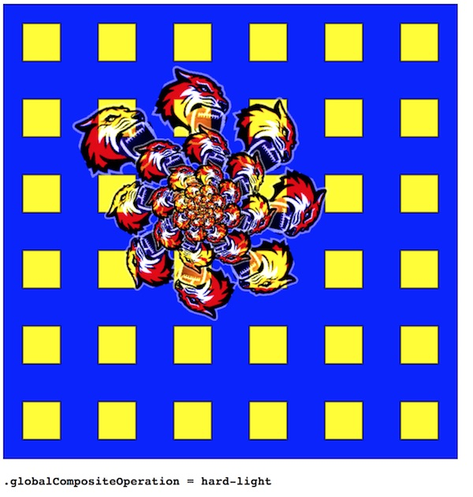

# Week 3B - Canvas Images & Blending Modes

## I. Overview
- Review [HW-canvas-helpers.md](https://github.com/tonethar/IGME-330-Master/blob/master/notes/HW-canvas-helpers.md)
- In 3 weeks we have covered the following canvas concepts:
  - getting a reference to the drawing "context" (a `CanvasRenderingContext2D` object) with `canvas.getContext('2d')`
  - setting drawing state attributes like `.fillStyle`, `.strokeStyle`, `.globalAlpha` and so on
  - building paths with: `.moveTo()`, `.rect()`, `.lineTo()`, `.arc()`, `.arcTo()`, ` .quadraticCurveTo()`, `.bezierCurveTo()`, `beginPath()` and `closePath()`
  - stroking and filling paths with `.stroke()` and `.fill()`
  - drawing text with `.strokeText()`, `.fillText()` and `.measureText()`
  - creating patterns and gradients with `.createLinearGradient()`, `.createRadialGradient()` and `.createPattern()`
  - canvas transformation: `.rotate()`, `.translate()` and `.scale()`
  - managing the drawing state stack with `.save()` and `.restore()`
- So let's finish up the basics of canvas by talking about:
  - drawing images!
  - blending (compositing) modes!

## II. Required Reading & Assignments
- [HW - Audio Visualizer - Part I](https://github.com/tonethar/IGME-330-Master/blob/master/notes/HW-AV-1.md)
- [HW - Audio Visualizer - Part II](https://github.com/tonethar/IGME-330-Master/blob/master/notes/HW-AV-2.md)
- [HW - Audio Visualizer - Part III](https://github.com/tonethar/IGME-330-Master/blob/master/notes/HW-AV-3.md)

## III. Presentation

1. **Drawing images onto the canvas**:
  - we can draw bitmap images into a `<canvas>` tag. The source of the image could be an `` tag, an `Image()` object, a SVG `<image>` element, a frame of a `<video>` element, or another `<canvas>` element
  - The method we will use is [ctx.drawImage()](https://developer.mozilla.org/en-US/docs/Web/API/CanvasRenderingContext2D/drawImage)
    - this method can be used to draw a whole image, or just a part of it. It can also be used to scale the image either up or down in size
  - see the demo file below:
    - it covers how to sample from and scale an image
    - be sure to look over how we use transforms to get some nice tiling effects
    - a nice thought experiment would be to think about how we could modify the code to download multiple images with our "pre-loader", instead of just one image
    
2. **Compositing** is the combining of visual elements from separate sources into single images. 
- The standard compositing mode of canvas is `source-over`, which is also known as the "painters model", where new shapes are drawn on top of the existing canvas content.
- canvas gives us a way to change this default behavior, and to change how different layers of an image interact. This is done with the `.globalCompositeOperation` property
- you can read about these different compositing operations here: [ctx.globalCompositeOperation](https://developer.mozilla.org/en-US/docs/Web/API/CanvasRenderingContext2D/globalCompositeOperation)
- see the demo file below


## IV. Demo Files

**canvas-image-demo.html**

```html
<!DOCTYPE html>
<html lang="en">
<head>
	<meta charset="utf-8" />
	<title>Canvas Image Demo</title>
	<style>
		canvas{
			border:1px solid black;
		}
	</style>
</head>
<body>
<canvas width="600" height="600"></canvas>

<script>
	const imageURL = "https://pbs.twimg.com/profile_images/1419014347/Logo_IGM_color_512x512.jpg";

	preloadImage(imageURL,init); 	

	// simple pre-loader that loads 1 image
	// preloadImage(imageURL,callbackFunc);
	function preloadImage(url,callback){
		let img = new Image();
		img.src = url;
		img.onload = _=>{
			callback(img)
		};
		img.onerror = _=>{
			console.log(`Image at url "${url}" wouldn't load! Check your URL!`);
		};
	}
	
	function init(img){
			let ctx = document.querySelector("canvas").getContext("2d");
			ctx.fillStyle = "yellow";
			ctx.fillRect(0,0,600,600);
			
			// 1 - ctx.drawImage(image, dx, dy); // dx = "destination x"
			ctx.drawImage(img,0,0);
			
			// 2 - ctx.drawImage(image, dx, dy, dWidth, dHeight); 
			// use dWidth and dHeight to scale the Image
			// ctx.drawImage(img,0,0,240,240);
				
			// 3 - ctx.drawImage(image, sx, sy, sWidth, sHeight, dx, dy, dWidth, dHeight);
			// use sx, sy, sWidth, sHeight to sample just part of the image
			//ctx.drawImage(img, 304, 140, 200, 200, 20, 20, 250, 250);
			
			// 4 - loop and draw!
			// ctx.translate(150,65);
// 			for(let i=0;i<55;i++){
// 				ctx.drawImage(img, 304, 140, 200, 200, -50, -50, 100, 100);
// 				ctx.translate(110-i*2,0);
// 				ctx.rotate(Math.PI/10);
// 				ctx.scale(.95,.95);
// 			}
	}
</script>
</body>
</html>
```

**blend-modes-demo.html**

```html
<!DOCTYPE html>
<html lang="en">
<head>
	<meta charset="utf-8" />
	<title>Canvas Blending Mode Demo</title>
	<style>
		canvas{
			border:1px solid black;
		}
	</style>
</head>
<body>
<canvas width="600" height="600"></canvas>

<script>
	const imageURL = "https://pbs.twimg.com/profile_images/1295528176/RIT_Football_Club_Logo__Public__400x400.png";


	preloadImage(imageURL,init); 	

	// simple pre-loader that loads 1 image
	// preloadImage(imageURL,callbackFunc);
	function preloadImage(url,callback){
		let img = new Image();
		img.src = url;
		img.onload = _=>{
			callback(img)
		};
		img.onerror = _=>{
			console.log(`Image at url "${url}" wouldn't load! Check your URL!`);
		};
	}
	
	function init(img){
			let ctx = document.querySelector("canvas").getContext("2d");
	
			// draw a background of yellow squares
			ctx.save();
			ctx.fillStyle = "yellow";
			ctx.translate(0,50);
			for(let i=0;i<12;i++){
				ctx.save();
				for(let j=0;j<12;j++){
					ctx.translate(50,0);
					 if(j%2==0 && i%2==0 ){
					 	 ctx.fillRect(-25,-25,50,50);
					 	 ctx.strokeRect(-25,-25,50,50);
					 }
				}
				ctx.restore();
				ctx.translate(0,50);
			}
			ctx.restore();
			
			/* Compositing */
			// https://developer.mozilla.org/en-US/docs/Web/API/Canvas_API/Tutorial/Compositing
			// default is "source-over"
			// try: destination-over,destination-out,lighter,xor,multiply,screen,overlay,darken,lighten,color-dodge,color-burn,hard-light,soft-light,difference,exclusion,hue,saturation,color,luminosity
			// these don't do much in this example: source-in,source-out,destination-in,destination-atop,copy

			// draw some tigers!
			ctx.save();
			ctx.globalCompositeOperation = "source-over"; 
			ctx.translate(150,80);
			for(let i=0;i<55;i++){
				//ctx.drawImage(image, sx, sy, sWidth, sHeight, dx, dy, dWidth, dHeight);
				ctx.drawImage(img, 0, 0, 400, 400, -50, -50, 100, 100);
				ctx.translate(110-i*2,0);
				ctx.rotate(Math.PI/8);
				ctx.scale(.95,.95);
			}
			ctx.restore();
	}
	
	
</script>
</body>
</html>
```

**blend-modes-demo-2.html**

```html
<!DOCTYPE html>
<html lang="en">
<head>
	<meta charset="utf-8" />
	<title>Canvas Blending Mode Demo II</title>
	<style>
		canvas{border:1px solid black;}
		p{font-family:monospace;font-weight:bold;font-size:1.2em;}
	</style>
</head>
<body>
<canvas width="600" height="600"></canvas>
<p>???</p>

<script>
	"use strict";
	const imageURL = "https://pbs.twimg.com/profile_images/1295528176/RIT_Football_Club_Logo__Public__400x400.png";
	let ctx = document.querySelector("canvas").getContext("2d");
	let rot = 0;
	let rotSpeed = -.01;
	let img;
	//let modes=["source-atop","destination-over","destination-out","lighter","xor","multiply","screen","overlay","darken","lighten","color-dodge","color-burn","hard-light","soft-light","difference","exclusion","hue","saturation","color","luminosity"];
	let modes=["source-over","exclusion","luminosity","xor","multiply","hard-light","difference","hue","saturation","color"];
	let colors = ["blue","red","green","magenta","teal","purple","yellow","coral","white","black","pink","orange","brown"];
	let index = 99;
	let currentMode = modes[index];
	let bgColor = colors[0];
	let squareColor = colors[1];

	changeMode();
	preloadImage(imageURL,loop); 	

	// simple pre-loader that loads 1 image
	// preloadImage(imageURL,callbackFunc);
	function preloadImage(url,callback){
		let i = new Image();
		i.src = url;
		i.onload = _=>{
			img = i;
			callback()
		};
		i.onerror = _=>{
			console.log(`Image at url "${url}" wouldn't load! Check your URL!`);
		};
	}
	
	function loop(){
			requestAnimationFrame(loop);
			rot += rotSpeed;
			
			
			// draw solid background
			ctx.globalCompositeOperation = "source-over";
			ctx.fillStyle = bgColor;
			ctx.fillRect(0,0,600,600);
			ctx.fillStyle = "transparent";
			ctx.fillRect(0,0,600,600);
			
			// draw a background of yellow squares
			ctx.save();
			ctx.fillStyle = squareColor;
			ctx.translate(0,50);
			for(let i=0;i<12;i++){
				ctx.save();
				for(let j=0;j<12;j++){
					ctx.translate(50,0);
					 if(j%2==0 && i%2==0 ){
					 	 ctx.fillRect(-25,-25,50,50);
					 	 ctx.strokeRect(-25,-25,50,50);
					 }
				}
				ctx.restore();
				ctx.translate(0,50);
			}
			ctx.restore();
			
			/* Compositing */
			// https://developer.mozilla.org/en-US/docs/Web/API/Canvas_API/Tutorial/Compositing
			// default is "source-over"
			// try: source-atop,destination-over,destination-out,lighter,xor,multiply,screen,overlay,darken,lighten,color-dodge,color-burn,hard-light,soft-light,difference,exclusion,hue,saturation,color,luminosity
			// these don't do much in this example: source-in,source-out,destination-in,destination-atop,copy
			
			ctx.save();
			ctx.globalCompositeOperation = currentMode; 
			ctx.translate(150,180);
			ctx.rotate(-rot);
			for(let i=0;i<55;i++){
				//ctx.drawImage(image, sx, sy, sWidth, sHeight, dx, dy, dWidth, dHeight);
				ctx.drawImage(img, 0, 0, 400, 400, -50, -50, 100, 100);
				ctx.translate(110-i*2,0);
				ctx.rotate(Math.PI/8 + rot);
				ctx.scale(.95,.95);
			}
			ctx.restore();
	}
	
		function changeMode(){
				// 1 - call this function again in 12-20 seconds
				setTimeout(changeMode,12000 + Math.random() * 8000);
				
				// 2 - change .globalCompositeOperation
				index++;
				if(index>=modes.length) index=0;
				currentMode = modes[index];
				document.querySelector("p").innerHTML = `.globalCompositeOperation = ${currentMode}`;
				
				// 3 - change rotation
				rotSpeed *= -1;
				rotSpeed += Math.random() * .02 - .01;
				if (Math.abs(rotSpeed < .002)) rotSpeed = .01;
				if (Math.abs(rotSpeed > .05)) rotSpeed = .01;
				
				// 4 - change squares
				bgColor = colors[Math.floor(Math.random() * colors.length)];
				squareColor = colors[Math.floor(Math.random() * colors.length)];
			}
	
	
	
</script>
</body>
</html>
```

## V. Screenshots

**Blend Modes Demo-2**



## VI. Reference
- https://developer.mozilla.org/en-US/docs/Web/API/Canvas_API/Tutorial/Using_images
- https://developer.mozilla.org/en-US/docs/Web/API/CanvasRenderingContext2D/drawImage
- https://developer.mozilla.org/en-US/docs/Web/API/CanvasRenderingContext2D/globalCompositeOperation
- https://developer.mozilla.org/en-US/docs/Web/API/Canvas_API/Tutorial/Compositing/Example


## VII. Lecture Videos

- [Week 3B - Intro (03:50)](https://video.rit.edu/Watch/d7BZf54H)
- [Week 3B - Drawing Images (18:44)](https://video.rit.edu/Watch/c3R4ZrSk)
- [Week 3B - Compositing Images (13:31)](https://video.rit.edu/Watch/Qi8c4X9G)


<hr><hr>

| <-- Previous Unit | Home | Next Unit -->
| --- | --- | --- 
| [**week-03A-notes.md**](week-03A-notes.md)     |  [**IGME-330 Schedule**](../schedule.md) | [**week-04A-notes.md**](week-04A-notes.md)
