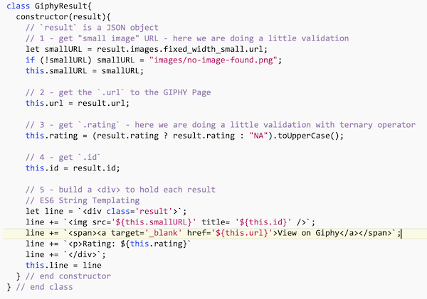
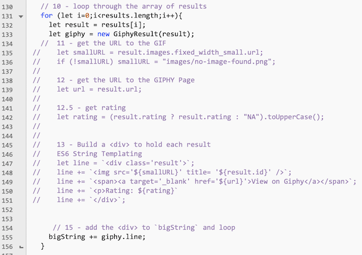

# Week 10B - ES6 Classes & Modules

## I. Using ES6 Classes in a Web App

- We are going to create a `GiphyResult` class for use in our GIF Finder HW
- Why create classes? It's easier to split the work up between team members, as well as debug, test and maintain your code
- Each `GiphyResult` instance will represent a single result that we get back from the Giphy web service
- This class will encapsulate our parsing logic, and also do some data validation
- Most of the code for this `GiphyResult` class is copied from the "result loop" in `searchButtonClicked()` and lightly modified
- Because we have a lot to do today, we are giving you the completed code. For now, add this class to the top of **main.js** (depending on how you wrote your code for the GIF Finder HW, you also might need to modify this slightly):

- your `GiphyResult` class now has 5 properties: `smallURL`,`url`,`rating`,`id` and `line`

- Now to use this code, make the "result loop" look like this: 

- Once you are all done, your code should work as before

## II. ES6 Modules 

- Let's discuss [ES6 Modules](https://github.com/tonethar/IGME-330-Master/blob/master/notes/ES6-modules-1.md) !
- Welcome back! See your HW assignment below!

## III. Homework

- You mission is to add ES6 modules to the GIF Finder HW that you added `GiphyResult` to above:
  - you already have a **main.js** file, so go ahead and create **classes.js** and **loader.js** files
  - move all the `GiphyResult` code from **main.js** to **classes.js**, and then export `GiphyResult`
  - in **main.js**:
    - import the `GiphyResult` class from **classes.js**
    - export `searchButtonClicked`
    - move your "window.onload code" from **main.js**  to **loader.js**

<!--
## III. NodeJS
- How to set up NodeJS
- Consuming Web Services from a command-line Node.js app. See mycourses dropbox for the due dates:
  - [Node.js and Web Services - 1](https://github.com/tonethar/IGME-330-Master/blob/master/notes/node-and-web-services-1.md)
  - [Node.js and Web Services - 2](https://github.com/tonethar/IGME-330-Master/blob/master/notes/node-and-web-services-2.md)
-->

| <-- Previous Unit | Home | Next Unit -->
| --- | --- | --- 
| [**week-10A-notes.md**](week-10A-notes.md)     |  [**IGME-330 Schedule**](../schedule.md) | [**week-11A-notes.md**](week-11A-notes.md)
